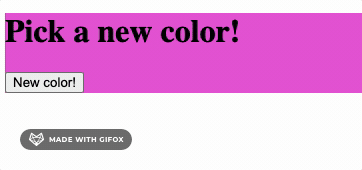

Click a button to generate a random color!

This project updates an old [Codecademy](https://www.codecademy.com/courses/learn-react-introduction/projects/random-color) project that used legacy code. It's more of a redo than a refactor, but it shows the magic of React Hooks + dynamic styling, which cut the lines of code nearly in half.

Fun fact: random color generators can help overcome creative blocks for designers and artists, much as the card-based '70s method [Oblique Strategies](https://en.wikipedia.org/wiki/Oblique_Strategies) encouraged lateral thinking
